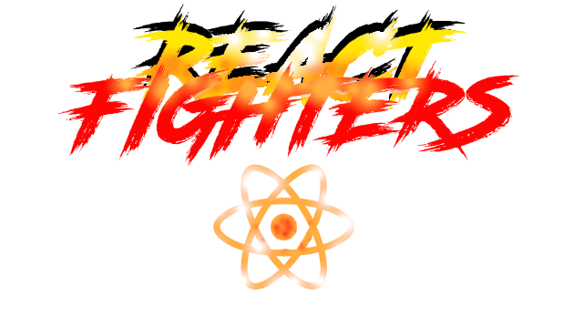

<p align="center">
    
</p>
<h2 align="center" style="border-bottom: none;">React Fighters</h2>

<h4 align="center">A simple card game based on Pokemon TCG</h4>

Remember it is only an input validator, you must handle form submit events.

- [Getting Started](#start)
- [Rules](#rules)
- [References](/docs/references.md)
- [TODO](/docs/todo.md)

## Motivation
I was tired of do APIs and other simple projects to training my React and Node skills then i tried to think and a simples project but different from other simple API consumers.

I am fascinated for games, so here is the result!

## <a name="start"></a>Getting Started

```bash
$ git clone https://github.com/PeterPimentel/react-card-game.git
$ cd react-card-game/
$ npm install
$ npm start
$ npm run server
```
Open 2 tabs from your browser and have fun!

## <a name="start"></a>Rules
.There's no rules! 😈 Just kidding
####Rules

1. You only can play one energy for turn.
1. You only can play one support card for turn.
1. Your attack is the last action in the turn.
1. The game finishes when some one get 3 victorys.
1. When you defeat a fighter you get one victory.
1. If your fighter dies, your arena is open. If the opponent attacks it will add one victory to him.
1. You only can play fighter in your arena from your reserve.

## License

MIT © [PeterPimentel](https://github.com/PeterPimentel)